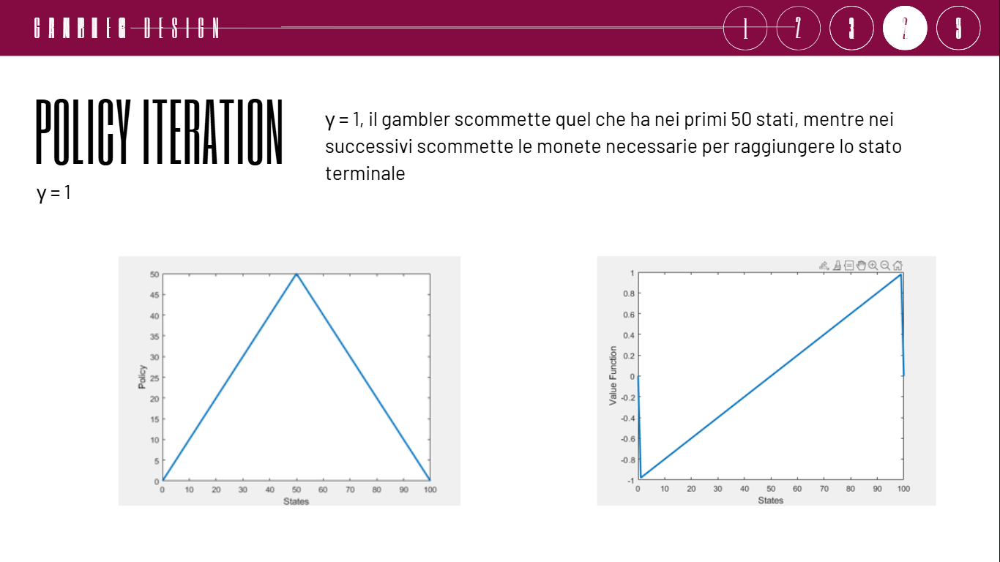
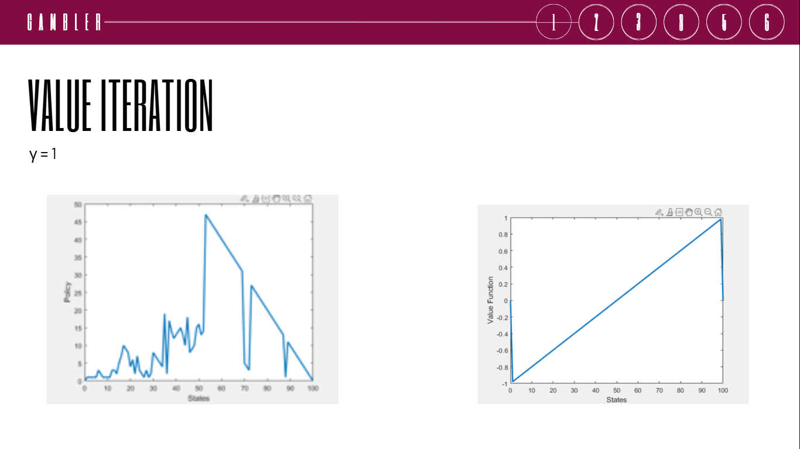

# Gambler Problem: Reinforcement Learning Analysis

## Descrizione
Questo progetto esplora la risoluzione del classico **Gambler’s Problem** tramite tecniche di **Reinforcement Learning**.

L’obiettivo è determinare la strategia di scommessa ottimale per un giocatore che desidera raggiungere un capitale target nel minor numero di episodi possibile.

---

## Definizione del problema

Il problema è modellato come un **Processo Decisionale Markoviano (MDP) episodico**.

Un giocatore effettua scommesse su un lancio di moneta con esiti:

- **Testa (win)** → guadagno pari alla puntata
- **Croce (loss)** → perdita della puntata

### Obiettivo:
Raggiungere esattamente **100 monete**

### Stati terminali:
- 0 monete → fallimento
- 100 monete → successo

---

## Specifiche del modello

- **Stati (S)**: 101 stati, da 0 a 100 (capitale corrente)
- **Azioni (A)**: scommessa possibile  
  \( a \in \{0, 1, ..., \min(s, 100-s)\} \)
- **Reward (R)**:
  - +1 → raggiungimento dello stato 100
  - 0 → tutti gli altri casi
- **Probabilità**:
  - moneta equa (p = 0.5)

---

## Algoritmi utilizzati

Il progetto implementa e confronta metodi classici basati sull’equazione di Bellman.

---

### Policy Iteration

Algoritmo iterativo composto da due fasi:

- **Policy Evaluation**  
  Stima della funzione valore \( V(s) \) per la politica corrente

- **Policy Improvement**  
  Aggiornamento della politica rendendola greedy rispetto a \( V(s) \)

Il processo viene ripetuto fino a convergenza.

---

### 📈 Value Iteration

Metodo che unisce valutazione e miglioramento:

- Aggiornamento diretto della funzione valore
- Applicazione iterativa dell’operatore di Bellman
- Arresto quando la variazione è inferiore a una soglia \( \theta \)

---

## Risultati e analisi

Lo studio è stato condotto variando il fattore di sconto \( \gamma \).

---

### Caso \( \gamma = 1 \)

- Strategia: aggressiva
- Il giocatore tende a scommettere grandi quantità di capitale nei primi stati
- Presenza di una struttura simmetrica della policy con massimo attorno a 50 monete
- Interpretazione: massimizzazione del ritorno finale senza penalità temporale

---

### Caso \( \gamma = 0 \)

- Strategia: conservativa
- Il giocatore scommette sempre il minimo possibile
- Approccio sequenziale verso il target finale
- Interpretazione: assenza di considerazione del futuro

---

## Conclusioni

Il problema evidenzia come il fattore di sconto \( \gamma \) influenzi drasticamente la strategia ottimale, producendo comportamenti completamente diversi tra approccio aggressivo e conservativo.

---

## Autore
Simonetta Ricci, Silvio Valentino

---

## Note
Progetto sviluppato nell’ambito dello studio dei **Markov Decision Processes (MDP)** e delle tecniche di **Dynamic Programming** in Reinforcement Learning.
