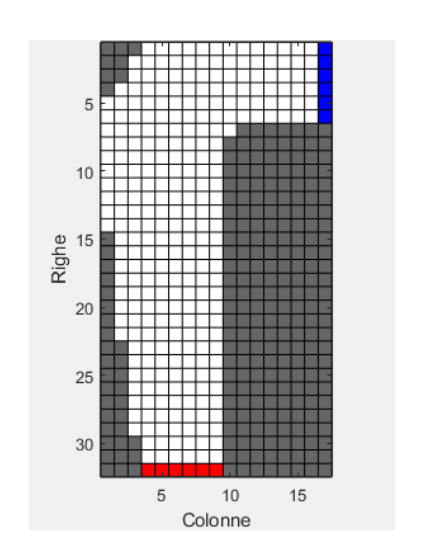
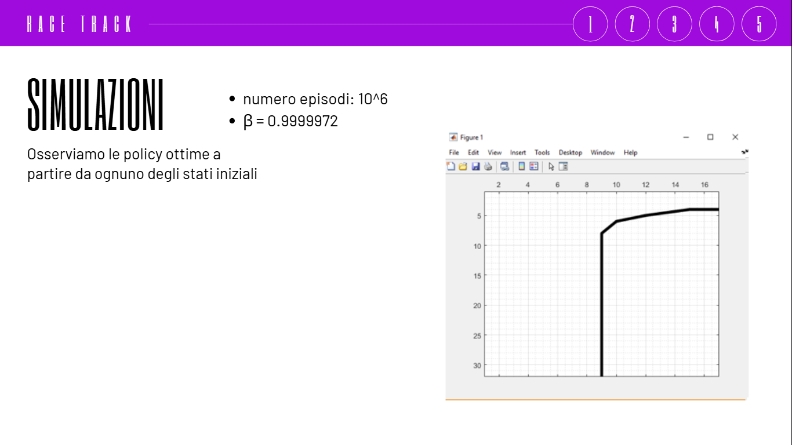
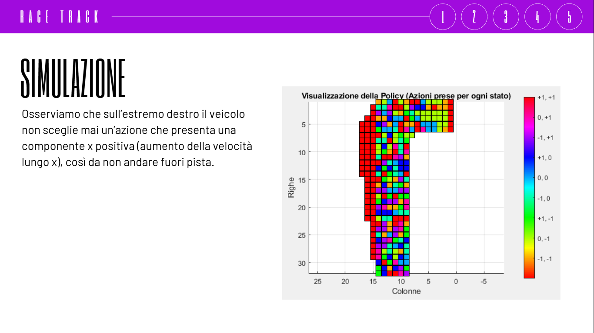

# Race Track Reinforcement Learning

## Descrizione
Questo repository contiene l’implementazione e l’analisi di un agente di **Reinforcement Learning** addestrato per la guida autonoma su un tracciato discreto.

L’obiettivo è completare il percorso nel minor tempo possibile evitando l’uscita di pista.

---

## Descrizione del problema

Il problema del **Race Track** è modellato come un ambiente decisionale episodico in cui un agente deve controllare un veicolo soggetto a dinamiche di inerzia.

L’agente apprende a bilanciare accelerazione e frenata per ottimizzare il tempo di percorrenza.

---

## Ambiente

- **Griglia di simulazione**: 32 × 17  
- **Stato (S)**:
  - posizione: (x, y)
  - velocità: (vₓ, vᵧ)
 

- **Azioni (A)**:
  - variazione velocità: {-1, 0, +1} su entrambe le direzioni  
  - vincolo: velocità non nulla simultaneamente (eccetto start)

---

## Reward

- penalità per ogni step temporale
- penalità per uscita di pista
- obiettivo: minimizzare il tempo totale di completamento

---

## Specifiche tecniche

- **Modello**: Processo Decisionale Markoviano episodico
- **Collisioni**:
  - uscita dalla pista → reset o rollback alla posizione valida
- **Numero episodi**:
  - fino a \(10^6\) iterazioni per convergenza

- **Esplorazione**:
  - decadimento: \( \beta = 0.9999972 \)

---

## Algoritmi implementati

### 🎲 Monte Carlo On-Policy
- apprendimento tramite esperienza diretta
- aggiornamento basato sui ritorni osservati
- esplorazione continua durante l’addestramento

---

### Monte Carlo Off-Policy
- separazione tra:
  - policy di comportamento
  - policy target
- utilizzo di Importance Sampling
- apprendimento di una policy ottimale più stabile

---

## Risultati

Le simulazioni mostrano che l’agente è in grado di:

- apprendere traiettorie efficienti
- accelerare nei rettilinei
- rallentare in prossimità delle curve
- convergere verso policy stabili nel tempo

I grafici evidenziano:
- convergenza della funzione valore
- miglioramento progressivo delle traiettorie

---

## Conclusioni

Il problema dimostra l’efficacia delle tecniche di **Monte Carlo Reinforcement Learning** nella pianificazione di traiettorie in ambienti dinamici con vincoli fisici.

---

## Autore
Simonetta Ricci, Silvio Valentino

---

## 📎 Note
Progetto sviluppato nell’ambito dello studio del **Reinforcement Learning applicato a problemi di controllo e navigazione autonoma**.
