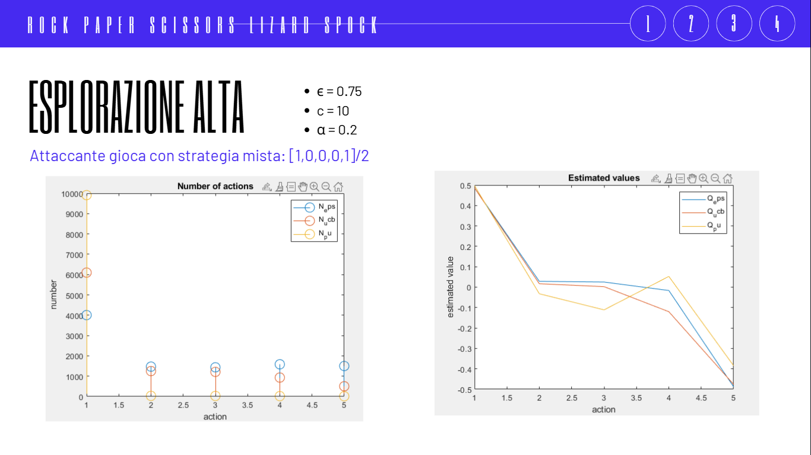
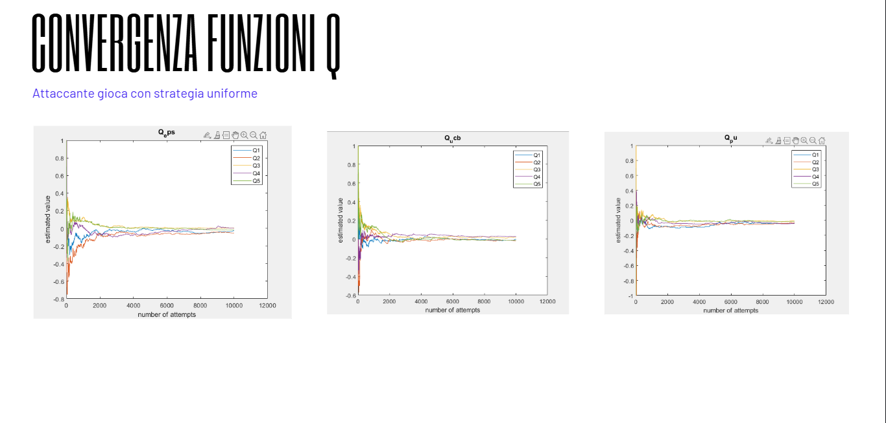

# Multi-Armed Bandit: Rock, Paper, Scissors, Lizard, Spock

## Descrizione
Questo repository contiene l’implementazione e l’analisi di un problema di **Multi-Armed Bandit (MAB)** applicato al gioco *Rock, Paper, Scissors, Lizard, Spock*, ispirato alla serie *The Big Bang Theory*.

L’obiettivo del progetto è modellare il gioco come un problema di **Reinforcement Learning** e confrontare diverse strategie di selezione delle azioni contro un avversario che gioca in modo casuale.

---

## Il gioco

Questa variante estesa del classico *Sasso, Carta, Forbice* introduce due ulteriori azioni: **Lizard** e **Spock**, rendendo la dinamica più complessa.

### Regole di vittoria:
- Forbice taglia Carta e decapita Lizard  
- Carta copre Sasso e smentisce Spock  
- Sasso schiaccia Lizard e rompe Forbice  
- Lucertola avvelena Spock e mangia Carta  
- Spock rompe Forbice e vaporizza Sasso  

---

## Parametri dell’esperimento

- **Azioni**: {Sasso, Carta, Forbice, Lizard, Spock}
- **Reward**:
  - +1 → vittoria
  - 0 → pareggio
  - -1 → sconfitta
- **Avversario**: selezione uniforme casuale
- **Obiettivo**: massimizzare la ricompensa cumulativa

---

## Policy implementate

Il progetto confronta diverse strategie di esplorazione ed exploitation.

### ε-Greedy (Sample-Average)
- Con probabilità ε esplora azioni casuali
- Con probabilità 1−ε sfrutta la migliore azione stimata
- Aggiornamento valori tramite media dei campioni

---

### Upper Confidence Bound (UCB)
- Seleziona azioni in modo ottimistico
- Bilancia reward stimato e incertezza
- Riduce la selezione di azioni sub-ottimali nel tempo

---

### Gradient Bandit (Preference Updates)
- Mantiene una preferenza numerica per ogni azione
- Aggiornamento tramite gradiente stocastico
- Favorisce azioni con reward superiore alla media

---

## Analisi e risultati

Il progetto analizza:

- Andamento del reward medio nel tempo per ogni policy
- Confronto delle prestazioni al variare dei parametri (ε, costanti UCB)
- Convergenza delle stime verso il valore atteso teorico
- Efficienza esplorazione vs sfruttamento

---

## Obiettivo finale

Studiare il comportamento delle diverse strategie di **Reinforcement Learning** in un ambiente stocastico semplice ma non banale, evidenziando trade-off tra esplorazione ed exploitation.

---

## Autore
Simonetta Ricci, Silvio Valentino

---

## Note
Progetto sviluppato nell’ambito dello studio di Reinforcement Learning e Multi-Armed Bandit problems.

